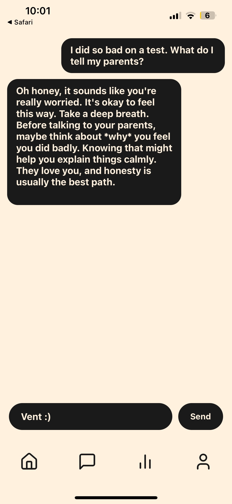
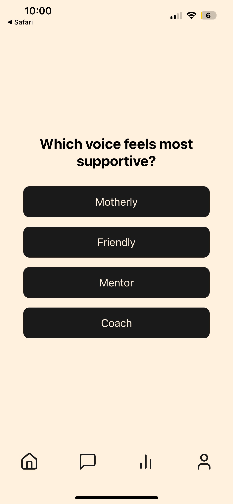

# Venty
Venty
* allows users to vent to a chatbot and will prompt self-reflection to a user
* understands context of each reflection session
* tracts emotional history with nuance
* adapts future reflection prompts based on past experiences with user.

<p align="left">
  
  
  
  
  
</p>


### Getting Started

#### 1. Clone the repo
```bash
git clone https://github.com/varunpalanisamy/Venty.git
cd Venty
```

#### 2. Set up the Python backend

Create and activate a virtual environment:
```bash
python -m venv venv
source venv/bin/activate
```

Install backend dependencies:
```bash
pip install -r requirements.txt
python -m spacy download en_core_web_md
```

Run the FastAPI backend server:
```bash
uvicorn app.main:app --reload
```

---

#### 3. Set up the React Native frontend

In a **new terminal**:

```bash
cd frontend
npm install
npx expo start
```

You can now run the app on iOS, Android, or your web browser using Expo.

---

### Tech Stack

- **Frontend:** React Native, TypeScript, Expo
- **Backend:** Python, FastAPI, Gemini API
- **NLP:** spaCy, TextBlob
- **Database:** MongoDB Atlas

---

### Features

- Sentiment analysis with personalized check-in delays
- Context extraction to detect meaningful topics
- Memory-based prompt generation from past threads
- Beautiful, user-friendly mobile UI with support for dark mode

---
